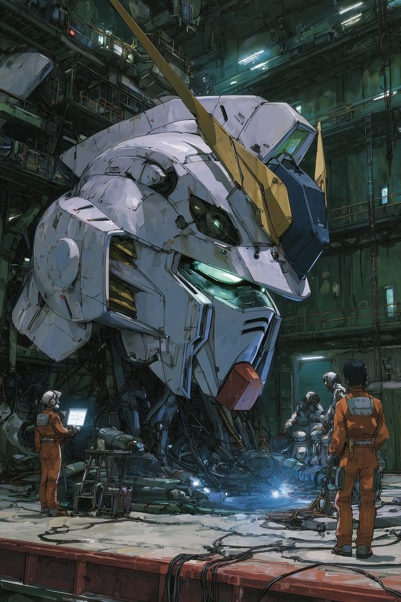

  

 

  
  
  

 

## Currently building

**[Nexus](https://github.com/rafabrh/nexus)** — Plataforma multi-tenant de automacao WhatsApp com agentes de IA, construida com NestJS, RabbitMQ, Evolution API e Postgres. Pipeline completo: mensagem entra via webhook, passa pelo engine de IA (Groq/OpenAI), e volta pro cliente em tempo real.

 

## Tech stack

  
   
  

 

<!-- Snake animation -->

  <picture>
    <source media="(prefers-color-scheme: dark)" srcset="https://raw.githubusercontent.com/rafabrh/rafabrh/output/snake-dark.svg">
    <source media="(prefers-color-scheme: light)" srcset="https://raw.githubusercontent.com/rafabrh/rafabrh/output/snake.svg">
    
  </picture>

